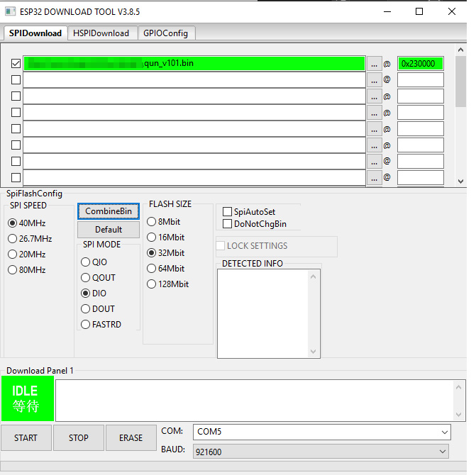

# Firmware

## Steps to update by using esptool (Mac OS X, Linux, or Windows)

1. Download and install CP210X driver. https://www.silabs.com/products/development-tools/software/usb-to-uart-bridge-vcp-drivers
2. Install [ESPTool](https://github.com/espressif/esptool). You may need to install Python as well.
3. Connect USB cable to Lyrat's (base board's) "UART" port. Disconnect all MIDI connections.
4. Open terminal and check your USB Serial port name.  For example, `/dev/cu.SLAB_USBtoUART` . For Linux, something like `/dev/ttyUSB0`. For Windows, something like `COM4`. 
5. Download the firmware from here.
6. Press "Boot" button and "RST" button on Lyrat board, keep pressing it, then release "RST" button only, then release "Boot" button. Now it should be firmware uploading mode.
7. Execute the following command. The number 0x230000 is very important. Don't put any other number. Otherwise it will break other important data such as saved preset or license information.
```
esptool.py --port /dev/cu.SLAB_USBtoUART write_flash 0x230000 qun_v101.bin
```
7. If you stall at  `Connecting......____`, then the board is not in firmware uploading mode. 
8. Press "RST" button to reboot the board. You should be able to see firmware version in the booting message.
```
QUN V1.01
```


## Steps to update by using Flash downlod tool (Windows only)

1. Download and install CP210X driver. https://www.silabs.com/products/development-tools/software/usb-to-uart-bridge-vcp-drivers
2. Download Flash download tool https://www.espressif.com/en/support/download/other-tools
3. Connect USB cable to Lyrat's (base board's) "UART" port. Disconnect all MIDI connections.
4. Open Device Manager and check your USB Serial port name. 
5. Download the firmware from here.
6. Press "Boot" button and "RST" button on Lyrat board, keep pressing it, then release "RST" button only, then release "Boot" button. Now it should be firmware uploading mode.
7. Execute flash download tool. Select ESP32 download tool. Follow the screenshot for the parameters. 0x230000 is the very important number(starting address of the firmware), do not put any other numbers in the field.




8. Press green button to flash the program. 
9. Press "RST" button to reboot the board. You should be able to see firmware version in the booting message.
```
QUN V1.01
```


# Release history

### v1.42 beta

- Behavior change : Envelope generator parameter change will affect immediately. (e.g. Decay change will affect current playing note immediately. Previously the change was postponed until next trigger)
- Fixed MIDI running status decoding issue

### v1.41 beta

- Improved time stretching quality
- Small bug fixes

### v1.40 beta

It's beta. The specification in the new feature could be changed. It may have bugs.

- New feature : Temporary MIDI CC override. You can assign any MIDI CC to any parameter easily for temporary convenient control.
- New feature : Granular synthesis engine.
- Behavior change: Now MIDI channel 1 message is treated as global channel message.

### v1.32

- Line in volume fix

### v1.31

- Now the synth always receives MIDI ch 1 (take ch1 as global channel)
- Bug fix: AUX L channel fix (AUX L was AUX R)

### v1.30

- Bug fix: AUX channel was swapped. 
- Buf fix: SYNC IN was not working properly.
- New feature: You can change sequencer's bank by pressing "Rec" and "Mode" button when you are in Play mode.
- New feature: You can copy sequencer bank in Sequencer Bank sub mode. See manual for detail.

### v1.28

- Bug fix: Input volume fix with line through mode and polyphonic mode.

### v1.27

- Bug fix: Some UI malfunctions caused by v1.25 fix. Please update if you use v1.25

### v1.26

- Fixed a bug : System crashes when Effect type values set to the max(127)

### v1.25

- Fixed MIDI receiving channel bug. (Dial cannot change the value when receiving MIDI channel is more than 1)

### v1.23

- ADC button logic rollback. Update is not necessary from v1.22 unless you have issues with button recognition. 

### v1.22

- Improved stability

### v1.21

- Small performance improvement to reduce possible glitch in extreme setting
- Improved stability

### V1.20

- Non-linear filter character was changed slightly.
- Improved pulse width transition

### V1.10

- Improved filter transition response.
- ADC button logic update, affected only for specific Lyrat boards which have unusual value.

### V1.01

- Improved stability

